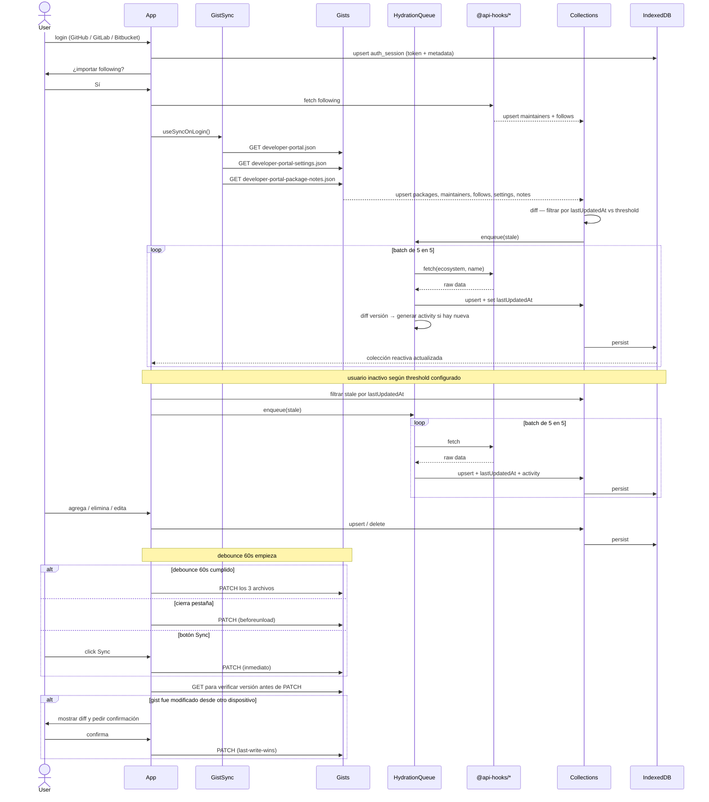
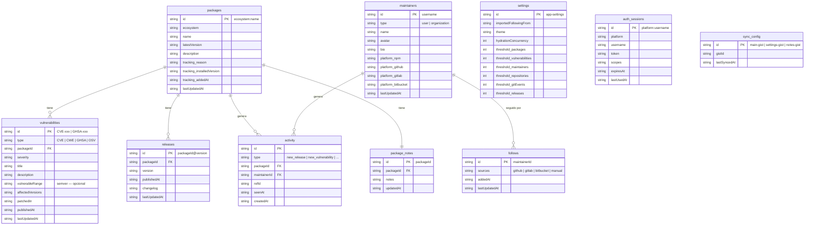

# Arquitectura: Collections

## Diagrama

```
                        ┌──────────────────────────────────────────────┐
                        │  Gist principal                              │
                        │  developer-portal.json                       │
                        │  { packages, maintainers, follows }          │
                        ├──────────────────────────────────────────────┤
                        │  developer-portal-settings.json              │
                        │  { theme, thresholds, hydration, ... }       │
                        ├──────────────────────────────────────────────┤
                        │  developer-portal-package-notes.json         │
                        │  [{ packageId, notes }]                      │
                        └────────┬─────────────────────────────────────┘
                 fetch (login)   │   PATCH (debounce 60s /
                        ┌────────┘    beforeunload / botón)
                        │
           ┌────────────▼─────────────────────────────────┐
           │  Gist Sync                                   │
           │  useSyncOnLogin  →  HydrationQueue (5 en 5)  │
           │  useGistWriteback  ←  cambios en colección   │
           └────────────┬─────────────────────────────────┘
                        │ fetch + upsert
                        ▼
┌──────────────────────────────────────────────────────────────┐
│  @api-hooks/npm, @api-hooks/pypi, @api-hooks/osv, ...        │
│  (TanStack Query)                                            │
└──────────────────────────────┬───────────────────────────────┘
                               │ data cruda
                               ▼
┌──────────────────────────────────────────────────────────────┐
│  @tanstack/query-db-collection                               │
│  Bridge hooks: fetch via api-hook → normalizar → upsert      │
│  useNpmPackageTracked · useMaintainerPackagesTracked · ...   │
└──────────────────────────────┬───────────────────────────────┘
                               │ upsert normalizado
                               ▼
┌──────────────────────────────────────────────────────────────┐
│  Collections (IndexedDB)                                     │
│  packages · maintainers · follows · vulnerabilities          │
│  releases · activity · settings · auth_sessions              │
│  package_notes · sync_config                                 │
└──────────────────┬───────────────────────────────────────────┘
                   │                         │
          upsert (write)              hooks de lectura
                   │                         │
┌──────────────────▼───────────┐  ┌──────────▼───────────────────┐
│  Bridge hooks (por api-hook) │  │  usePackageTracked            │
│  useNpmPackageTracked        │  │  useMaintainerTracked         │
│  useMaintainerPkgsTracked    │  │  useVulnerabilityTracked      │
│  useVulnerabilityTracked     │  │  filtros por ecosystem / type │
└──────────────────────────────┘  └──────────┬────────────────────┘
                                             │
                               ┌─────────────▼──────────────┐
                               │  Componentes React          │
                               │  reactivo, offline-ready    │
                               └────────────────────────────┘
```

---

## Diagrama de secuencia



---

## Diagrama de base de datos



---

## Colecciones

> Todas las colecciones que se sincronizan incluyen `lastUpdatedAt: string`. El hydration queue usa este campo para determinar si un registro está stale según el threshold configurado en `settings`.

---

### `packages`

```ts
type Ecosystem =
  | 'npm'       // JavaScript / TypeScript
  | 'pypi'      // Python
  | 'crates'    // Rust
  | 'rubygems'  // Ruby
  | 'nuget'     // .NET
  | 'maven'     // Java / Kotlin
  | 'packagist' // PHP
  | 'pub'       // Dart / Flutter
  | 'hex'       // Elixir
  | 'cocoapods' // iOS / macOS
  | 'docker'    // Containers
  | 'helm'      // Kubernetes
type TrackingReason = 'installed' | 'following' | 'interest'

interface TrackedPackage {
  id: string                // `${ecosystem}:${name}` — ej: "npm:react"
  ecosystem: Ecosystem
  name: string
  latestVersion: string
  description?: string
  tracking: {
    reason: TrackingReason
    installedVersion?: string  // solo si reason === 'installed'
    addedAt: string
  }
  lastUpdatedAt: string
  raw: NpmPackument           // | PypiPackage | ...
}
```

---

### `maintainers`

```ts
interface Maintainer {
  id: string                 // username — mismo id si coincide en varias plataformas
  type: 'user' | 'organization'
  name: string
  avatar?: string
  bio?: string
  platforms: {
    npm?: string
    github?: string
    gitlab?: string
    bitbucket?: string
  }
  lastUpdatedAt: string
}
```

---

### `follows`

Relación entre el usuario y un maintainer. Separado de `maintainers` — dejar de seguir borra este registro sin tocar el perfil.

```ts
interface Follow {
  id: string                 // maintainerId
  sources: Array<'github' | 'gitlab' | 'bitbucket' | 'manual'>
  addedAt: string
  lastUpdatedAt: string
}
```

---

### `vulnerabilities`

```ts
interface Vulnerability {
  id: string                 // CVE-2024-xxxx / GHSA-xxxx / CWE-xxx
  type: 'CVE' | 'CWE' | 'GHSA' | 'OSV'
  packageId: string          // FK → packages.id
  severity: 'critical' | 'high' | 'medium' | 'low'
  title: string
  description?: string
  vulnerableRange?: string   // semver range — ej: ">=1.0.0 <1.4.2" — no aplica para docker
  affectedVersions: string[] // versiones o tags concretos — ej: ["1.0.0", "alpine", "latest"]
  patchedIn?: string         // primera versión que corrige la vulnerabilidad
  publishedAt: string
  lastUpdatedAt: string
}
```

Consultas habituales:

- **¿Mi versión está afectada?** → `semver.satisfies(myVersion, vuln.vulnerableRange)`
- **¿Qué vulnerabilidades tiene la versión X?** → `vuln.affectedVersions.includes(x)`
- **¿Ya hay fix disponible?** → comparar `packages.latestVersion` con `vuln.patchedIn`

Relaciones:

- `vulnerability.packageId` → `packages.id`
- `vulnerability.vulnerableRange` / `affectedVersions` → contra versiones en `releases`

---

### `releases`

```ts
interface Release {
  id: string           // `${packageId}@${version}`
  packageId: string    // FK → packages.id
  version: string
  publishedAt: string
  changelog?: string
  lastUpdatedAt: string
}
```

---

### Actividad de maintainers (on-demand, sin IndexedDB)

Commits, PRs, issues y eventos de plataformas git **no se persisten en IndexedDB**. Se consumen on-demand via api-hooks y TanStack Query los cachea en memoria durante la sesión. La UI muestra un botón "Ver en GitHub / GitLab / Bitbucket" para navegar al origen.

| Plataforma | Endpoint | Normalización |
| --- | --- | --- |
| GitHub | `GET /users/{username}/events/public` | `PushEvent` → commit, `PullRequestEvent` → pull_request, `IssuesEvent` → issue, `ReleaseEvent` → release, `WatchEvent` → star, `ForkEvent` → fork |
| GitLab | `GET /users/{id}/events` | `pushed to` → commit, `opened` MR → pull_request, `opened` issue → issue, `commented on` → comment |
| Bitbucket | `GET /users/{username}/events` | `repo:push` → commit, `pullrequest:created` → pull_request, `issue:created` → issue |

> Si en el futuro se necesita **notificar** al usuario sobre nueva actividad de un maintainer (ej. "sindresorhus publicó un nuevo PR"), se evaluará persistir estos eventos en una colección dedicada en ese momento.

---

### `activity`

Generada localmente por el hydration queue al detectar cambios.

```ts
interface ActivityEvent {
  id: string
  type: 'new_release' | 'new_vulnerability' | 'maintainer_added' | 'package_deprecated'
  packageId?: string     // FK → packages.id
  maintainerId?: string  // FK → maintainers.id
  refId: string          // id del release, vuln, etc.
  seenAt?: string        // undefined = no leído
  createdAt: string
}
```

Generación en el hydration queue:

```ts
const existing = packagesCollection.utils.getById(incoming.id)

if (existing && existing.latestVersion !== incoming.latestVersion) {
  activityCollection.utils.insert({
    id: crypto.randomUUID(),
    type: 'new_release',
    packageId: incoming.id,
    refId: `${incoming.id}@${incoming.latestVersion}`,
    createdAt: new Date().toISOString(),
  })
}
```

---

### `package_notes`

Notas privadas del usuario por package. Solo en IndexedDB y en `developer-portal-package-notes.json` — nunca en el gist principal.

```ts
interface PackageNote {
  id: string           // packageId
  packageId: string    // FK → packages.id
  notes: string
  updatedAt: string
}
```

---

### `settings`

Objeto único (id fijo `"app-settings"`). Se sincroniza en `developer-portal-settings.json`.

```ts
interface AppSettings {
  id: 'app-settings'
  importedFollowingFrom: Array<'github' | 'gitlab' | 'bitbucket'>
  theme: 'light' | 'dark' | 'system'
  hydrationConcurrency: number   // default 5
  refreshThresholds: {
    packages: number             // default 30 min
    vulnerabilities: number      // default 1440 min (24h)
    maintainers: number          // default 60 min
    releases: number             // default 1440 min (24h)
  }
}
```

---

### `auth_sessions`

Solo en IndexedDB — nunca en el gist. Token encriptado.

```ts
interface AuthSession {
  id: string                     // `${platform}:${username}`
  platform: 'github' | 'gitlab' | 'bitbucket'
  username: string
  token: string                  // encriptado en IndexedDB
  scopes: string[]               // ej: ["read:user", "gist"]
  expiresAt?: string             // undefined = no expira
  lastUsedAt: string
}
```

---

### `sync_config`

Un registro por gist. Guarda el `gistId` y el `lastSyncedAt` de cada fuente para diffs eficientes y detección de conflictos.

```ts
interface SyncConfig {
  id: 'main-gist' | 'settings-gist' | 'notes-gist'
  gistId: string
  lastSyncedAt: string
}
```

---

## Lógica del hydration queue

El queue no persiste estado. Al abrir la app, el diff entre gist e IndexedDB recalcula automáticamente qué está stale basándose en `lastUpdatedAt` vs el threshold configurado.

```ts
function needsRefresh(lastUpdatedAt: string, thresholdMinutes: number): boolean {
  const age = Date.now() - new Date(lastUpdatedAt).getTime()
  return age > thresholdMinutes * 60 * 1000
}

// en useSyncOnLogin y useIdleSync:
const stale = packagesCollection.utils
  .getAll()
  .filter((pkg) => needsRefresh(pkg.lastUpdatedAt, settings.refreshThresholds.packages))

hydrationQueue.enqueue(stale.map(({ ecosystem, name }) => ({ ecosystem, name })))
```

Si el proceso se interrumpe, los registros no procesados conservan su `lastUpdatedAt` viejo y se detectan como stale en el próximo login o idle sync.

---

## Gists

### `developer-portal.json`

```json
{
  "packages": [
    {
      "ecosystem": "npm",
      "name": "react",
      "tracking": { "reason": "installed", "installedVersion": "18.2.0" }
    }
  ],
  "maintainers": [{ "id": "sindresorhus", "type": "user" }],
  "follows": [{ "id": "sindresorhus", "sources": ["github"] }]
}
```

### `developer-portal-settings.json`

```json
{
  "importedFollowingFrom": ["github"],
  "theme": "dark",
  "hydrationConcurrency": 5,
  "refreshThresholds": {
    "packages": 30,
    "vulnerabilities": 1440,
    "maintainers": 60,
    "releases": 1440
  }
}
```

### `developer-portal-package-notes.json`

```json
[
  { "packageId": "npm:react", "notes": "considerar migrar a solid-js" },
  { "packageId": "npm:vite", "notes": "no actualizar a v6 aún" }
]
```

---

## Idle sync

Re-fetch basado en `lastUpdatedAt` vs threshold cuando el usuario lleva inactivo el tiempo configurado, o al presionar Sync. No actualiza el gist.

**`src/services/idleSync.ts`**

```ts
const IDLE_TIMEOUT = 30 * 60 * 1000

let timer: ReturnType<typeof setTimeout>

function resetTimer() {
  clearTimeout(timer)
  timer = setTimeout(runIdleSync, IDLE_TIMEOUT)
}

async function runIdleSync() {
  const settings = settingsCollection.utils.getById('app-settings')
  const stale = packagesCollection.utils
    .getAll()
    .filter((pkg) => needsRefresh(pkg.lastUpdatedAt, settings.refreshThresholds.packages))

  await hydrationQueue.enqueue(stale.map(({ ecosystem, name }) => ({ ecosystem, name })))
}

export function startIdleSync() {
  ;['mousemove', 'keydown', 'scroll', 'touchstart'].forEach((e) =>
    window.addEventListener(e, resetTimer)
  )
  resetTimer()
}

export function stopIdleSync() {
  clearTimeout(timer)
  ;['mousemove', 'keydown', 'scroll', 'touchstart'].forEach((e) =>
    window.removeEventListener(e, resetTimer)
  )
}
```

---

## Purge

El usuario decide cuándo purgar desde Settings. No hay purge automático.

Colecciones con datos históricos purgables:

| Colección | Criterio de purge |
| --- | --- |
| `activity` | Por fecha o por `seenAt` (solo los ya leídos) |
| `releases` | Por fecha |

---

## Flujo de datos

| Acción | Qué pasa |
| --- | --- |
| Login en dispositivo nuevo | upsert `auth_session` → prompt following → fetch 3 gists → diff por `lastUpdatedAt` → `hydrationQueue` |
| `hydrationQueue` procesa | Fetcha 5 en 5 → upserta + `lastUpdatedAt` → genera `activity` si hay versión nueva |
| Usuario inactivo (threshold) | `useIdleSync` → filtra stale por `lastUpdatedAt` → re-fetch → `activity` |
| Botón Sync | Re-fetch stale + PATCH 3 gists inmediato |
| Conflicto de gist | Muestra diff al usuario → confirma → last-write-wins |
| Visita página de un package | `useNpmPackageTracked` fetcha → upserta + `lastUpdatedAt` |
| Sigue a un maintainer | `useMaintainerPackagesTracked` → `upsertMany` en `packages` + `follows` |
| Agrega / elimina package | debounce 60s → PATCH `developer-portal.json` |
| Agrega / edita nota | debounce 60s → PATCH `developer-portal-package-notes.json` |
| Cambia settings | debounce 60s → PATCH `developer-portal-settings.json` |
| Cierra la pestaña | `beforeunload` → PATCH 3 gists |
| Purge manual | Usuario elige colección y rango → delete en IndexedDB |
| Recarga la página | Colecciones se rehidratan desde IndexedDB sin fetch |
| Componente lee datos | `usePackageTracked()` / `useCollectionData(collection)` — reactivo |

---

## Notas de implementación

- `@tanstack/db` está en beta activa — verificar el nombre exacto del adapter de IndexedDB en la versión instalada.
- `lastUpdatedAt` en todas las colecciones sincronizadas — es la clave del sistema de refresh sin persistir el queue.
- El queue no persiste estado — el diff por `lastUpdatedAt` recalcula automáticamente los stale al reabrir la app.
- `auth_sessions` nunca va al gist — solo IndexedDB con token encriptado.
- `follows` separado de `maintainers` — dejar de seguir borra `follows` sin tocar el perfil.
- `activity` se genera localmente en el hydration queue — no requiere backend.
- `sync_config` guarda `lastSyncedAt` por gist para detección de conflictos antes del PATCH.
- IndexedDB no tiene límite fijo pero degrada con miles de registros sin índices — `activity` y `releases` son las colecciones que más crecen con el tiempo.
- `beforeunload` con `fetch` no es fiable en todos los browsers — considerar `navigator.sendBeacon` como fallback.
- Al agregar un nuevo ecosistema: añadir a `Ecosystem`, crear `normalize*`, agregar caso en `fetchAndUpsert`. El resto no cambia.
